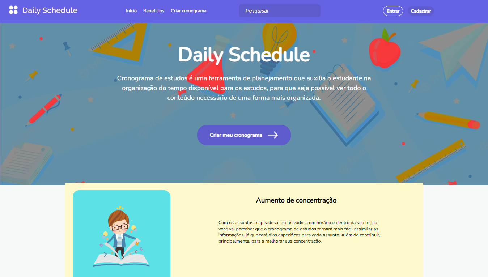

# Daily Schedule

 
Solução em organização acessível para todos os estudantes. O Daily Schedule tem como objetivo ajudar na organização dos estudos e rotinas de um estudante no seu dia a dia, através da criação de cronogramas diários, semanais e mensais. Sua interface tem uma boa usabilidade, sendo minimalista e intuitiva.

## 🛠️ Tecnologias

- [Python](https://www.python.org/)
- [Django REST framework](https://www.django-rest-framework.org/)
- [JavaScript](https://www.javascript.com/)
- [HTML](https://www.w3schools.com/html/)
- [CSS](https://www.w3schools.com/css/)
- [React](https://pt-br.reactjs.org/docs/lifting-state-up.html)

### 📋 Documentação

Você encontra a documentação do projeto no diretório [`docs`](https://github.com/tads-cnat/dailyschedule/tree/main/docs).

### 🔧 Instalação

**Executando o back-end da aplicação**

```sh
sudo apt-get install python3-pip
```
```sh
sudo pip install virtualenv
```
Dentro da pasta .\dailyschedule criar ambiente virtual
```sh
python3 -m venv venv
```
```sh
source venv/bin/activate
```
Instalando dependências
```sh
pip install -r requirements_backend.txt
```
Rodar migrações
```sh
cd backend/core
```
```sh
python3 manage.py migrate
```
```sh
python3 manage.py runserver
```

**Executando o front-end da aplicação**
```sh
cd ./dailyschedule/frontend
```
```sh
npm install
```
```sh
npm start
```

## ✒️ Equipe

<table>
  <tr>
    <td align="center"><a href="https://github.com/BrenoNAlmeida"><br /><b>Breno Almeida</b></a><br /><a href="https://github.com/BrenoNAlmeida"</td>
      <td align="center"><a href="https://github.com/dani7fl7"><br /><b>Daniela Lima</b></a><br /><a href="https://github.com/dani7fl7"</td>
      <td align="center"><a href="https://github.com/Deivdson"><br /><b>Deivdson Pereira</b></a><br /><a href="https://github.com/Deivdson"</td>
    <td align="center"><a href="https://github.com/Esdryan"><br /><b>Esdryan</b></a><br /><a href="https://github.com/Esdryan"</td>
    <td align="center"><a href="https://github.com/Jefferson-F-Ribeiro"><br /><b>Jefferson Ribeiro</b></a><br /><a href="https://github.com/Jefferson-F-Ribeiro"</td>
    <td align="center"><a href="https://github.com/lucasmelonds"><br /><b>Lucas Melo</b></a><br /><a href="https://github.com/lucasmelonds"</td>
  </tr>
</table>
